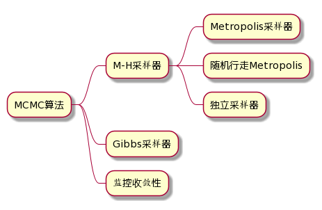

# 基本定义和定理

## 马氏链基本定义  

### 离散时间马氏链

> 设 ${X_n, n ≥ 0}$ 是取有限个或可列个值的随机过程，若 $X_n = i$, 表示过程在时刻 $n$ 状态处于$ i$,
>
> $S = \{0, 1, · · · \}$为状态集. 若对一切 $n$ 有
> $$
> \begin{align}
> &P(X_{n+1} = j| X_0 = i_0, X_1 = i_1, ... , X_{n−1} = i_{n−1}, X_n = i) \\
> &= P(X_{n+1} = j| X_n = i)\\
> &= p_{ij}
> \end{align}
> $$
> 则称$ {X_n, n ≥ 0}$ 是离散时间马尔科夫链，常简称为马氏链  

- 过程${X_n,n\geq 0}$的将来状态${X_{n+1}}$只与现在状态${X_n}$有关，而与过去状态${X_k,k\leq n-1}$无关

- 转移概率矩阵满足条件$p_{ij} \geq 0, \sum_{j\in S} p_{ij} =1$

- 时间齐次马氏链：

  - 若条件概率 $P(X_{n+1}=j|X_n=i)= p_{ij}$与$n$无关，则称马氏链有`平稳转移概率`，也称为`时间齐次马氏链`

  - 用$\pi_n$表示马氏链处于各状态的分布向量：$\pi_n =P^n \pi_0$

  - MCMC中仅仅关注时间齐次马氏链

### 连续时间马氏链


### 平稳分布

> 设马尔科夫链有转移概率矩阵 $P=(p_{ij})$,一个概率分布$\pi=\{ \pi_i, i\geq 0 \}$
>
> 如果满足 $\pi_j = \sum_{i\in S} \pi_i p_{ij}$,即 $\pi=p\pi$，则称之为此马尔科夫链的平稳分布

- 初始状态$X_0$有平稳分布$\pi = {\pi_i,i\geq0}$,即$\pi(X_0=j)=\pi_j$,则有$\pi=P\pi$

  对$\forall j,P(X_1=j)=\sum_{i\in S} P(X_1=j|X_0=i) =\sum_{i\in S}\pi_i p_{ij}=\pi_j$

- $\pi_n=P^n \pi = P\pi =\pi$

  $P(X_n =j )=\sum_{i\in S}P(X_n=j|X_{n-1}=i)P(X_{n-1}=i) = \sum_{i\in S}\pi_i p_{ij }$

  于是所有的$n,X_n$有相同的分布$\pi$

### 连续转移空间$S$

> 转移核$P(x,A)$定义为从任意$x\in S$转移到可测集$A \subset S$的概率
> $$
> P(x,A) = \int_{y\in A}p(x,y)dy,\forall x\in S
> $$

### 不可约性


### 周期与非周期 


### 正常返


### 遍历性 


## 定理

### 细致平衡方程

>设 $\pi$为一个取值于可数状态空间 $S $上的一个概率分布，如果一个马氏链的转移核满足对 $n = 0,1,...$ 有  
>$$
>\pi_jP(X_{n+1}=i|X_n=j) =\pi_i P(X_{n+1}=j|X_n=i), \forall i,j \in S
>$$
>称$\pi$为该马氏链的平稳分布

- 对两边$j$求和有
  $$
  \sum_{j\in S}\pi_jP(X_{n+1}=i|X_n=j) =\sum_{j\in S}\pi_i P(X_{n+1}=j|X_n=i)=\pi_i 
  $$
  


# 算法

## Metropolis-Hastings Sampler(M-H)

$f(\cdot)$表示目标分布，$g(\cdot)$表示提议分布

目标

算法流程：

>- 选择一个提议分布 $g(\cdot|X_t)$
>- 从分布$g(\cdot|X_t)$中产生$X'$
> - 从均匀分布$U(0,1)$中产生$U$
> - 如果$U\leq \frac{f(X')g(X_t|X')}{f(X_t)g(X'|X_t)}$就接受$X'$,令$X_{t+1}=X'$，否则$X_{t+1}=X_t$
>- 重复直到产生平稳分布(根据某些准则)

注意：

> - 提议分布的支撑集包含目标分布的支撑集
> - 容易从中抽样, 常取为已知的分布，如正态或 t 分布等
> - 提议分布应使接受概率容易计算
> - 提议分布的尾部要比目标分布的尾部厚
> - 接受概率：
>   - 当参数维数是 1 时，接受概率应略小于 0.5 是最优的  
>   - 当维数大于 5 时，接受概率应降至 0.25 左右.  

### M-H抽样方法的理论依据

#### 离散情形

记 $q_{i j}=g\left(x_{t+1}=j \mid x_{t}=i\right)$ 容易看出, $\mathrm{M}-\mathrm{H}$ 抽样方法产生的样本序列 $x_{0}, x_{1}, \ldots$ 为一马氏链, 其转移核为
$$
p_{i j}=q_{i j} \alpha(i, j)+\delta_{i}(j)(1-r(i))
$$
其中 $r(i)=\sum_{j} q_{i j} \alpha(i, j), \alpha(i, j)=\min \left\{1, f_{j} q_{j i} / f_{i} q_{i j}\right\},f_i=f(x_t=i),f_j=f(x_{t+1}=j) \delta_{i}(j)$ 为 $dirac-delta$ 函数。
另一方面, 对 $i \neq j$ 有
$$
f_{i} q_{i j} \alpha(i, j)=f_{i} q_{i j} \min \left\{1, \frac{f_{j} q_{j i}}{f_{i} q_{i j}}\right\}=f_{j} q_{j i} \min \left\{1, \frac{f_{i} q_{i j}}{f_{j} q_{j i}}\right\}=f_{j} q_{j i}
$$
以及$i=j$时
$$
f_i\delta_i(j)(1-r(i)) = f_j\delta_j(i)(1-r(j))
$$
从而满足细致平衡方程
$$
p_{ij} f_i = p_{ji}f_j, \forall i,j
$$
从而$ f $为该链的平稳分布。可以进一步验证此链是不可约、遍历的，因此 $f $是其唯一的平稳分布  

#### 连续情形

记 $P\left(x_{t+1}=j \in A \mid x_{t}=x\right)=\int_A p(y|x)dy$ 容易看出, $\mathrm{M}-\mathrm{H}$ 抽样方法产生的样 本序列 $x_{0}, x_{1}, \ldots$ 为一马氏链, 其转移核为
$$
p(x,A)=q_{i j} \alpha(i, j)+\delta_{i}(j)(1-r(i))
$$
其中 $r(i)=\sum_{j} q_{i j} \alpha(i, j), \alpha(i, j)=\min \left\{1, f_{j} q_{j i} / f_{i} q_{i j}\right\}, \delta_{i}(j)$ 为 $dirac-delta$ 函数。
另一方面, 对 $i \neq j$ 有
$$
f_{i} q_{i j} \alpha(i, j)=f_{i} q_{i j} \min \left\{1, \frac{f_{j} q_{j i}}{f_{i} q_{i j}}\right\}=f_{j} q_{j i} \min \left\{1, \frac{f_{i} q_{i j}}{f_{j} q_{j i}}\right\}=f_{j} q_{j i}
$$
以及$i=j$时
$$
f_i\delta_i(j)(1-r(i)) = f_j\delta_j(i)(1-r(j))
$$
从而满足细致平衡方程
$$
p_{ij} f_i = p_{ji}f_j, \forall i,j
$$
从而$ f $为该链的平稳分布。可以进一步验证此链是不可约、遍历的，因此 $f $是其唯一的平稳分布  

### Metropolis 抽样方法

提议分布是对称的，即
$$
g(X|Y)=g(Y|X)
$$
因此接受概率为
$$
\alpha(X_t,Y) = min{\frac{f(Y)}{f(X_t)},1}
$$

### 随机游走Metropolis


### 独立抽样方法


### 逐分量M-H抽样方法


## Gibbs抽样方法

>即将从多元目标分布中抽样转化为从一元目标分布抽样，这是 Gibbs 抽样的重要性所在.  

Gibbs 抽样方法特别适合于目标分布是多元的场合，其最令人感兴趣的方面是为了产生不可约的、非周期、并以高维空间的目标分布作为其平稳分布的马氏链，只需要从一些一元分布（全条件分布）中进行抽样就可以了。

### 计算步骤

- 记$X_1,...,X_p$为联合密度为$f(x_1,...,x_p)$

$$
X_{-i} = (X_1,...,X_{i-1},X_{i+1},...,X_p)
$$

​		并记$X_i|X_{-i}$的`全条件密度`为
$$
f(x_i|x_{-i}) = f(x_i|x_1,...,x_{i-1},x_{i+1},...,x_p)
$$

- 设置初始值 $\mathbf{x}^{(0)}=(x_1^{(0)},...,x_p^{(0)})$出发，迭代产生
  $$
  x_1^{(t)} \sim f(x_1|x_2^{(t-1)},x_3^{(t-1)},...,x_p^{(t-1)}) \\
  x_2^{(t)} \sim f(x_2|x_1^{(t-1)},x_3^{(t-1)},...,x_p^{(t-1)}) \\
  \cdots \\
  x_i^{(t)} \sim f(x_i|x_1^{(t-1)},...,x_{i-1}^{(t-1)},x_{i+1}^{(t-1)},...,x_p^{(t-1)}) \\
  \cdots \\
  x_p^{(t)} \sim f(x_i|x_1^{(t-1)},...,x_{i-1}^{(t-1)},x_{i+1}^{(t-1)},...,x_p^{(t-1)}) \\
  $$

- 对 $t= 1,2,...,T$迭代产生

  从 


## 定理

设 随 机 变 量 $X = (X1, . . . , Xp)$ 的 联 合 密 度 为$f (x_1,..., x_p),$ 边际密度为$ f_i (x_i)$, 称 $X$满足正性条件,
如果 $f_i (x_i) > 0(i = 1,..., p) $的意味着 $f (x_1, . . . , x_p) > 0.  $

### (Hammersley-Clifford)联合密度定理

>设$(X_1,..., X_p)$满足正性条件, 且有联合密度$ f (x_1,..., x_p) $. 则对所有 $(ξ1,..., ξp) ∈ supp(f)$ 有  
>$$
>f(x_1,...,x_p) \propto \prod_{j=1}^p \frac{f(x_j|x_1,...,x_{j-1},\xi_{j+1},...,\xi_{p})}{f(\xi_{j}|x_1,...,x_{j-1},\xi_{j+1},...,\xi_{p})}
>$$


# 收敛性检验方法

## Gelman-Rubin方法

Gelman-Rubin

从不同的初始值产生的几个平行的链，初始值非常分散，链达到平稳以后，表现应该是一样的，`Gelman-Rubin`指出链内的方差和链之间的方差应该是相同的

### 定义

令$\psi$是缩放的汇总统计，估计目标分布的某些参数

产生$k$条长度为$n$的链 $\{X_{ij}:1\leq i\leq K,1\leq j \leq n\}$，链的初始时间为$t=1$

计算在时刻$n$的 $\psi_{in}=\psi(X_{i1},...,X_{in})$

如果链以$n\rightarrow\infty$收敛到目标分布，则统计数据的抽样分布$\{\psi_{in}  \}$应该收敛为共同的分布

考虑到到时刻$n$的链的代表数据都来自$K$组单向$ANOVA$的数据与$n$个观测值

计算样本间方差和样本内方差的估计值，类似于均方误差和
$$
B = \frac{1}{K-1}\sum_{i=1}^K \sum_{j=1}^n (\bar{\psi}_{i\cdot}-\bar{\psi}_{\cdot\cdot})^2 = \frac{1}{K-1}\sum_{i=1}^K (\bar{\psi}_{i\cdot}-\bar{\psi}_{\cdot\cdot})^2 \\
\bar{\psi}_{i\cdot} = \frac{1}{n} \sum_{j=1}^n \psi_{ij},\bar{\psi}_{\cdot\cdot} = \frac{1}{nK}\sum_{i=1}^K \sum_{j=1}^n \psi_{ij}
$$
第$i$个序列，样本间方差为
$$
s_i^2 = \frac{1}{n} \sum_{j=1}^n (\psi_{ij}-\bar{\psi}_{i\cdot})^2
$$
样本间方差汇总估计值
$$
W = \frac{1}{(n-1)K} \sum_{i=1}^K (n-1)s_i^2 = \frac{1}{K} \sum_{i=1}^K s_i^2
$$
方差的序列间和序列内估计组合在一起，用来估计$\hat{Var}(\psi)$的上界
$$
Var(\hat{\psi}) = \frac{n-1}{n}W+\frac{1}{n}B
$$

- 如果链是来自目标分布的随机样本，那么上式是$Var(\psi)$的一个无偏估计

- 如果链的初始值过度分散，但是当$n\rightarrow\infty$时，收敛到$Var(\psi)$，那么上式有正的偏差
- 如果链没有随时间$n$收敛，则链上位在整个目标分布的支撑集中很好的混合，因此样本内方差$W$低估了$\psi$的方差

我们期待上式随着$n\rightarrow \infty$从上收敛到$Var(\psi)$，$W$从下面收敛到$Var(\psi)$

如果$\hat{Var}(\psi)$相对$W$较大，表明链条没有随着时间$n$增加收敛到目标分布

`Gelman-Rubin`统计量
$$
\sqrt{\hat{R}} = \sqrt{\frac{\hat{Var}(\psi)}{W}} = \sqrt{\frac{n-1}{n}+\frac{1}{n}\frac{B}{W}}
$$
如果延伸链条来测量$\psi$的标准偏差，当链长度趋于无穷大的时候，$\sqrt{\hat{R}}$ 因子会衰减到 `1`

如果链大致收敛到目标分布，则$\sqrt{\hat{R}}$ 应该接近`1`


### 计算步骤


### ANOVA——组间方差和组内方差


## QQ图

QQ图是判断链产生的样本分位数和目标分布的理论分位数拟合好坏的一种方法

如果QQ图上的点基本集中在一条直线附近，那么显示样本分位数和理论分位数是高度近似一致的

```R
burn <- 1000 #去掉开始的样本点
y <- x[(burn+1):m]
a <- ppoints(100)
QR <- sigma* sqrt(-2*log(10a)) #Rayleigh 分布的分位数
Q <- quantile(x,a)
qqplot(QR,Q,xlab = "Rayleigh QUantiles",ylabe = "Sample Quantiles")
hist(y,breaks = "scott",xlab = "sample",freq = FALSE)
lines(QR,f(QR,4))
```


 ### R语言获取样本分位数

```R
quantile(x, probs = seq(0, 1, 0.25), na.rm = FALSE,names = TRUE, type = 7, digits = 7, ...)
```

|   参数   |                             含义                             |
| :------: | :----------------------------------------------------------: |
|   `x`    | 数值向量,`NA`和`NaN`不允许出现在数值向量中，除非`na.rm =TRUE` |
| `probs`  |                  分位数数值向量`[0,1]`区间                   |
| `na.rm`  | 逻辑值；如果`na.rm =TRUE`，那么在计算分位数前`NA`和`NaN`将从`x`中移除 |
| `names`  |                           逻辑值；                           |
|  `type`  |           整数`[1,2,...,9]`；选择9种分位数算法之一           |
| `digits` |                     仅仅当`names = true`                     |

