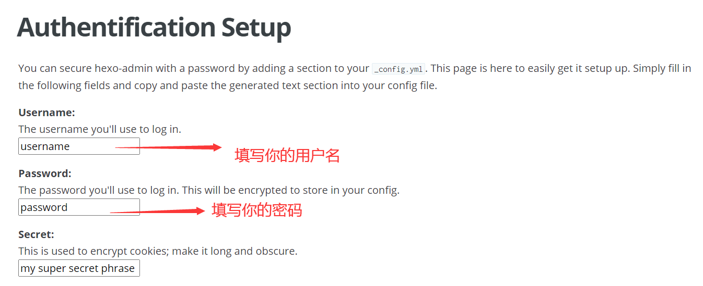
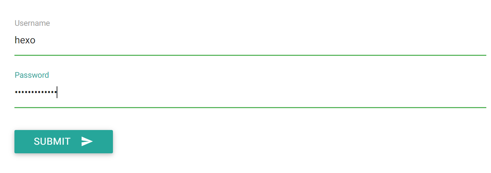

# 创建新文章

`git` 中进入根目录输入 `hexo new <模板> <文章名>` 新建文章
其中`<模板>`在`source`文件夹下面，默认有三个模板 `post`,`draft`,`page`

命令行输入

```md
hexo new post aiticle_title
```

此时会在 `source/_posts/` 文件夹中多了一个 `aiticle_title.md` 文件
打开后可以看到 `---`之间的内容为文章的配置内容

模板配置文件可以在`/scaffolds/post.md`修改`post.md`模板

```md
---
title: {{ title }}
author: 爱养虫的小熊
date: {{ date }}
tags: []
categories:
    - [个人博客,Hexo]
top: 1
feature: true
mathjx: true  #是否开启数学公式支持
comment: true
---
```

# 如何插入图片

HEXO生成静态界面时，同一篇文章会在多处页面生成，例如首页、文章详情页等，而不同页面与图片的相对位置是不一样的，而该方式hexo不会自动处理图片引用

Vscode和Hexo在网页渲染的图片位置是不一样的试用好久才发现如下的格式两者都会显示图片

在`source`中新建一个`images`目录用于存放图片，将图片放在该目录下，示例:

例1. 如在`myblog/source/images/notecover/Firstblog.png`的这张图片想引用的时候VScode和网页都能看到要用如下格式

```md

或者

```

如果使用格式以下格式

## 网页端看不到的格式|VScode能看到

```md


```

## VsCode看不到的格式|网页端能看到

```md

```

## 网页端和VsCode都看不到的格式

```md


```

例2.  如在`myblog/source/_post/Linux常用命令.md`文件中插入`myblog/source/_post/Linux常用命令/cup进程.png`的这张图片想引用的时候VScode和网页都能看到要用如下格式

```md


```

下面的方法只能在文章`Linux常用命令.md`中插入同文件夹路径下的图片`Linux常用命令/tupian.png`

```md

```

## VScode能看到的格式|网页端看不到

```md

```

## 网页端能看到的格式|VScode看不到

```md


```

## 网页端和VScode都不能看到

```md


```

# 如何插入链接

格式:
```md
[](链接)
```

<!--more-->

# hexo-admin插件管理博客写作

每次新建文章和写作文章都在`git`命令行中，很不方便，于是可以安装这款插件
[参考hexo-admin官方页面](https://github.com/jaredly/hexo-admin)

```md

npm install --save hexo-admin
hexo g
hexo s
open <http://localhost:4000/admin/>

```

然后浏览器输入`http://localhost:4000/admin/`进入管理界面`setting`



[我的笔记](/mynotes/math/common_dstribute.html)

复制下面生成的 `Admin Config Section`内容到 `/blog/_config.yml`粘贴在最后即可
之后登陆需要输入账户密码

在Deploy之前，还要编辑网站配置文件`_config.yml` （否则会出现`Error: Config value "admin.deployCommand" not found`)报错
如果实在`Windows系统`，这在末尾加上

```md
deployCommand:'hexo-generate.bat'
```
